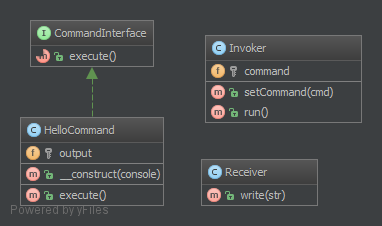

# Command

## Propósito

Encapsular invocação e desacoplação

Tem-se um Invoker (invocador) e um Receiver (receptor). Esse Padrão usa um 
comando ("Command") para delegar a chamada ao método contra o Receiver e 
apresentar o mesmo método "execute". Assim, o Invoker sabe que é preciso chamar 
"execute" para processar o comando do cliente. O Receiver é desacoplado do 
Invoker.

O segundo aspecto desse padrão é o `undo()`, que desfaz o método `execute()`. 
Command também pode ser agregado para combinar comandos mais complexos com um 
copiar-colar mínimo e confiando na composição em detrimento de herança.

## Exemplos

* Um editor de texto: todos eventos são Commands que podem ser desfeitos, 
empilhados e salvos
* Symfony2: Commands SF2 que podem ser rodados a partir da linha de comando (CLI) 
com apenas o Padrão Command em mente
* Grandes ferramentas CLI usam subcomandos para distribuir várias tarefas e 
agrupá-las em "módulos", cada um podendo ser implementado com Command (por 
exemplo, Vagrant)

## Diagrama UML

