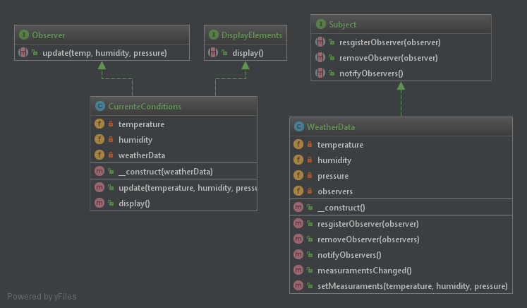

# Observer

## Definição

Entenda o padrão observer como uma editora de revistas. Enquanto você é
assinante, permanece recebendo as notícias sempre que uma nova edição
é lançada. Porém uma vez que você solicite o cancelamento da assinatura
, ficará desatualizado e só poderá receber as novidades caso refaça a sua 
assinatura. 

O padrão observer define uma relação um-para-muitos em que uma vez que o Subject mude, 
todos os observers serão notificados automaticamente. 

Queira objetos levemente ligados, ou seja, podem interagir, mas sabem pouco
um do outro. Isso permite que o sistema seja modificado mais facilmente 
pois a interdependência entre os objetos é menor.

## Diagrama UML

