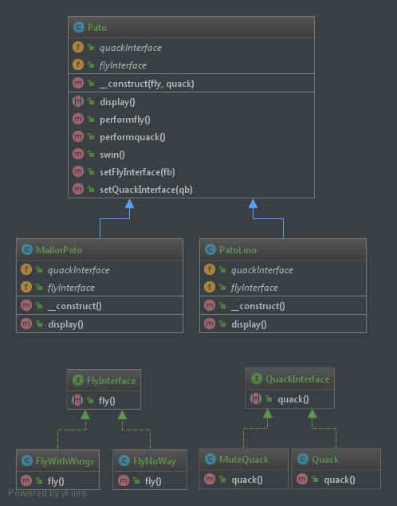

# Strategy

## Definição

O padrão Strategy define uma família de algoritmos, encapsula cada um deles e 
os torna intercambiáveis. A estratégia deixa o algoritmo variar idependente
dos clientes que o utilizam.

Programe pra interface bichão, nunca pra implementação, assim fará códigos mais flexíveis.
Outra coisa, prefira a composição, é melhor TER UM do que SER UM, pois ter um pode
ser facilmente adquirido, basta comprar ou ganhar, mas ser um é uma coisa mais forte, você
já nasce aquilo e se livrar dos comportamentos é mais complicado!!!

E não se esqueça. Pegue o que está variando e encapsule!!!!!

## Diagrama UML

