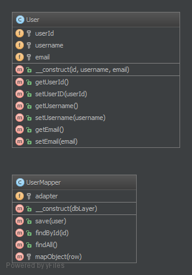

# Data Mapper

## Propósito

Um Data Mapper é uma camada de acesso a dados que realiza transferências 
bidirecionais e dados entre uma cama de persistência (geralmente um Banco de 
Dados Relacional) e uma representação de dados em memória (a camada de domínio). 
O objetivo desse Padrão é manter a representação de dados em memória e a camada 
de persistência de dados independentes uma da outra e do próprio Data Mapper. 

A camada é composta por um ou mais mappers -- ou Data Access Objects (Objetos de 
Acesso a Dados) -- fazendo a transferência de dados. Cada implementação de um 
mapper varia em escopo: mappers genéricos lidarão com vários tipos diferentes de 
entidades de domínio; mappers dedicados lidarão com um ou alguns.

A chave desse Padrão -- diferentemente do Active Record -- é fazer com que o 
modelo de dados (data model) siga o Princípio da Responsabilidade Única do 
S.O.L.I.D.

## Exemplos

* DB Object Relational Mapper (ORM): Doctrine2 usa um DAO chamado "EntityRepository"

## Diagrama UML

