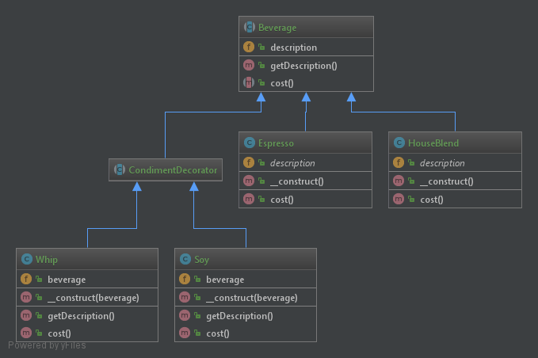

# Decorator

## Definição

O padrão Decorator anexa responsabilidades adicionais a um objeto dinamicamente.
Os decoradores fornecem uma alternativa flexível de subclasse para estender funcionalidades.

No exemplo do diagrama, eu desejo fazer o pedido de um café em uma cafeteria.
Primeiramente, cada tipo de café tem o seu preço, e mais, depois poderemos
adicionar condimentos ao café pedido o que elevaria o seu preço e cada condimento
pode ser adicionado varias vezes a gosto do fregûes!!

Já no java, por exemplo, uma aplicação seria no Java I/O que tem varios
tipos decorados com outros tipos. O InputStream  é decorado com FileInputStream 
, ArrayInputStream, StringInputStream, ... Com isso o objeto poderá ler uma String, um número, um texto..
vai depender dos objetos que o decoram...

Isso dá um up no princípio Aberto/Fechado pois com o uso de decorators poderemos
escrever código sem se preocupar se o tipo usado será ou não lido, por exemplo.

## Diagrama UML

