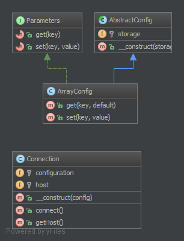

# Dependency Injection

## Propósito

Implementar arquitetura de baixo acoplamento para obter códigos mais testáveis, 
manuteníveis e extensíveis.

## Uso

A configuração é injetada e `Connection` irá pegar tudo o que for preciso de 
`$config`. Sem DI -- Dependency Injection ou Injeção de Depenência --, a 
configuração seria criada diretamente em `Connection`, o que não é muito bom para 
testar e estender `Connection`.

Perceba que se está seguindo o Princípio de Inversão de Controle em `Connection` 
ao `$config` implementar a interface `Parameters`. Isso desacopla os componentes. 
Não importa de onde vem a fonte de informação; somente importa que `$config` tem 
certos métodos para retornar essa informação.

[Leia mais sobre Inversão de Controle](http://pt.wikipedia.org/wiki/Invers%C3%A3o_de_controle).

## Exemplos

* O ORM Doctrine2 usa Injeção de Dependência em, por exemplo, configurações que 
são injetadas em um objeto `Connection`. Para propósitos de teste, é possível criar 
um objeto mock da configuração and injetá-lo num objeto `Connection`
* Symfony e Zend Framework 2 já possuem contêiners para DI (Dependency Injection) 
que criam objetos através de um array de configuração e os injeta onde é preciso 
(por exemplo, em controllers)

## Diagrama UML

